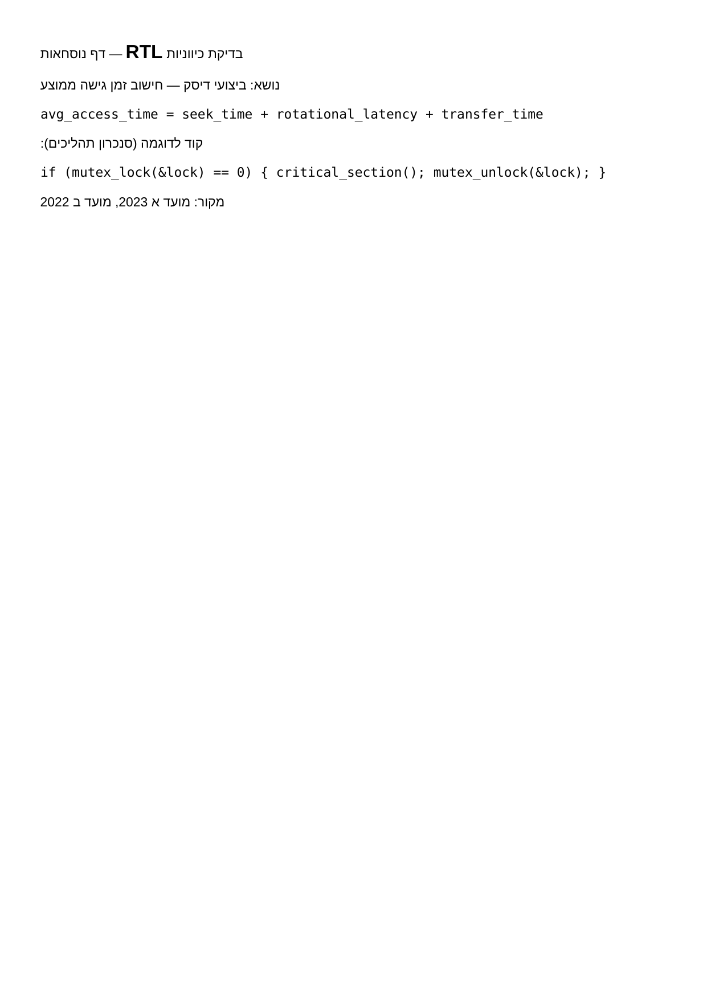
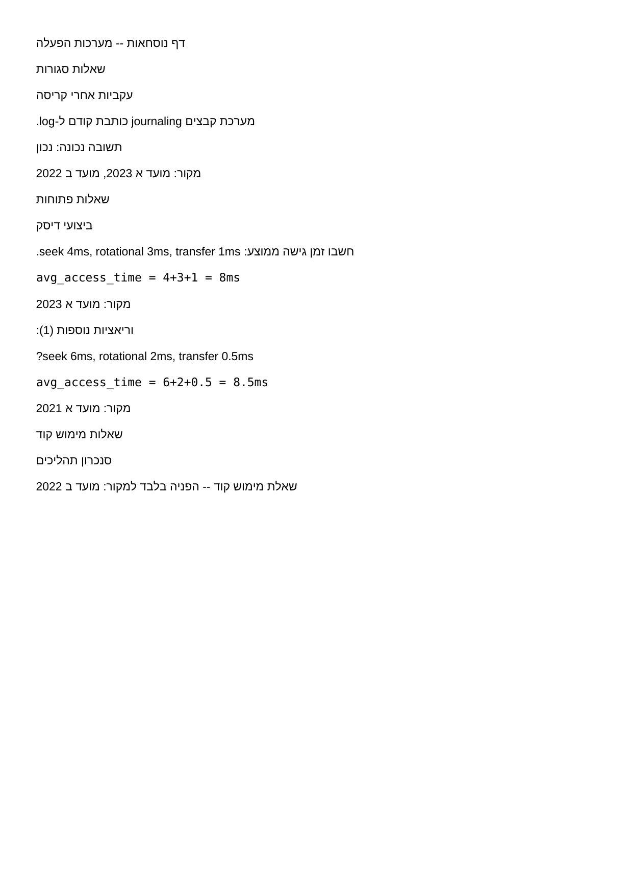

# PoC RTL — תוצאות (Milestone 1, פרק 11)

**סטטוס: הצליח.** נבדק לפני כתיבת שאר הקוד, לפי סדר העבודה המומלץ בפרק 11.

## מה נבדק

יצירת מסמך `docx` עם `python-docx`, שמערבב:
- כותרות ופסקאות בעברית (RTL, מיושר לימין).
- נוסחה באנגלית (`avg_access_time = seek_time + rotational_latency + transfer_time`) בשורת LTR נפרדת.
- קטע קוד C (`if (mutex_lock(&lock) == 0) { ... }`) בשורת LTR נפרדת.

ואז המרה ל-PDF באמצעות `soffice --headless --convert-to pdf` (LibreOffice), ורינדור
העמוד לתמונה (`pdftoppm`) לבדיקה ויזואלית.

## מנגנון טכני

כל פסקה מקבלת סימון כיווניות מפורש ברמת ה-XML של docx (`w:bidi`), ולא נשענת
על ניחוש אוטומטי של Word/LibreOffice:

```python
def set_rtl(paragraph):
    pPr = paragraph._p.get_or_add_pPr()
    bidi = OxmlElement('w:bidi')
    bidi.set(qn('w:val'), '1')
    pPr.append(bidi)
    paragraph.alignment = WD_ALIGN_PARAGRAPH.RIGHT

def set_ltr(paragraph):
    pPr = paragraph._p.get_or_add_pPr()
    bidi = OxmlElement('w:bidi')
    bidi.set(qn('w:val'), '0')
    pPr.append(bidi)
    paragraph.alignment = WD_ALIGN_PARAGRAPH.LEFT
```

## תוצאה



עברית מיושרת נכון לימין, הנוסחה והקוד מוצגים ב-LTR תקין בשורות נפרדות,
בדיוק לפי הכלל בפרק 05: "טקסט עברי (RTL) לצד נוסחאות/קוד/מונחים באנגלית —
בשורות נפרדות, לא מעורבבים באותה שורה".

בדיקה נוספת, קצה-לקצה, על בנק שאלות מלא (3 סוגי פריטים) עם אותו מנגנון:



## מסקנה לגבי החלטת פרק 10, סעיף 10

המסלול המומלץ **python-docx → LibreOffice headless** עבד כצפוי על התוכן
שנבדק. **חשוב:** זה לא מבטל את הצורך לבדוק שוב על דאטה אמיתי ומורכב יותר
(טבלאות, טקסט ארוך יותר, תווים מיוחדים) בשלב האינטגרציה (סנכרון 2/3) —
ה-PoC כאן מכסה את המקרה הבסיסי בלבד. אם תתגלה בעיה על דאטה אמיתי, המעבר
המתוכנן הוא ל-WeasyPrint (שלד הפונקציה קיים ב-`backend/export/pdf_builder.py`,
`build_pdf_via_weasyprint`, לא ממומש).

## איך לשחזר את הבדיקה

```bash
cd backend
python3 -c "
from pathlib import Path
from backend.schemas import MergedBank
from backend.export.pdf_builder import build_pdf
import json
bank = MergedBank(**json.loads(Path('../fixtures/sample_merged.json').read_text()))
build_pdf(bank, Path('/tmp/test.pdf'))
"
pdftoppm -png -r 150 /tmp/test.pdf /tmp/test_page
```
